# RA_10409476_DevSis_2.2
Lucas Bittencourt de Oliveira, TIA: 42219851 || RA: 10409476

<h2><a href="https://www.mackenzie.br">Universidade Presbiteriana Mackenzie</a></h2>
<h3><a href="https://www.mackenzie.br/graduacao/sao-paulo-higienopolis/sistemas-de-informacao">Sistemas de Informação</a></h3>

## Conteúdo

- [Autores](#autores)
- [Cenário de Negócio/Concepção](#cenário-de-negócioconcepção)
- [Modelagem de negócio e prototipação](#modelagem-de-negócio-e-prototipação)
- [TG1 – Cenário de Negócio, Concepção do Sistema e Modelo de Casos de Uso](#tg1--cenário-de-negócio-concepção-do-sistema-e-modelo-de-casos-de-uso)
- [TG2 – Modelagem de Negócio e Prototipação](#tg2--modelagem-de-negócio-e-prototipação)
- [TG2 – Prototipação](#tg2--prototipação)
- [TG3 – Especificação de Requisitos](#tg3--especificação-de-requisitos)
- [TG4 – Modelos de Interação com Aplicação de Padrões GRASP](#tg4--modelos-de-interação-com-aplicação-de-padrões-grasp)

# Autores

* Lucas Bittencourt de Oliveira - TIA 42219851/RA 10409476

# Cenário de Negócio/Concepção: 

**O problema ou oportunidade percebida:**

O problema identificado é a gestão ineficiente das informações dos funcionários em
empresas de médio e grande porte, onde muitas ainda utilizam processos manuais ou
sistemas descentralizados. Isso resulta em falhas na comunicação, perda de
informações, retrabalho e baixa eficiência operacional. 

**A razão ou justificativa para esta demanda:**

A necessidade de um sistema informatizado surge para reduzir erros de dados,
melhorar a segurança das informações, otimizar a administração de funções cruciais e
garantir um controle hierárquico eficiente de acessos e permissões. 

**A descrição sucinta do produto de software que será produzido:**

O sistema será um software de cadastro de funcionários, permitindo centralização das informações, validação automática de dados, controle de acesso por níveis, busca eficiente e gestão simplificada para facilitar a administração de recursos humanos. 

**Identifique os clientes, usuários e demais envolvidos/impactados com o produto:**

- Gerentes: Principais usuários do sistema, responsáveis pelo cadastro, edição e exclusão de informações dos funcionários sob sua supervisão.
- Departamentos de Recursos Humanos: Impactados diretamente pelo sistema, pois ele facilitará a coleta, atualização e análise de dados dos funcionários.
- Funcionários: Beneficiados indiretamente pela melhoria na gestão das suas informações dentro da empresa.

**Identifique os principais critérios de qualidade para o produto:**

- Centralização das informações: Dados armazenados de maneira organizada e acessível.
- Validação automática de dados: Evita erros em informações críticas como CPF e CEP.
-  Controle de acesso por níveis: Garante que apenas gerentes autorizados possam editar ou excluir dados.
-  Busca eficiente: Permite localização rápida de funcionários pelo nome ou ID
-  Usabilidade: Interface intuitiva e fácil de usar para garantir adoção pelos usuários.
-  Segurança: Proteção de dados sensíveis contra acessos não autorizados.
-  Eficiência operacional: Redução do tempo gasto em processos manuais e eliminação de retrabalho.

# Modelagem de negócio e prototipação

**Metodologia de Modelagem**
A modelagem de domínio foi realizada com base na abordagem orientada a objetos, visando estruturar o
sistema de maneira modular e reutilizável. Foram utilizadas técnicas de modelagem como UML (Unified
Modeling Language) e padrões de análise para definir as entidades e suas relações, garantindo coerência e
expansibilidade do sistema. 

**Estrutura da Modelagem**

A modelagem foi estruturada em:

- Entidades Principais: Representam os principais elementos do sistema.
- Relacionamentos: Definem como as entidades interagem entre si.
- Regras de Negócio: Determinam as restrições e comportamentos esperados do sistema.

**2. Entidades Principais**

As seguintes entidades foram identificadas e modeladas: 
- Usuário
- ID
- Nome
- Email
- Senha (criptografada)
- Tipo (Gerente ou Funcionário)
- Gerente (Especialização de Usuário)
- Lista de Funcionários supervisionados
- Permissão para edição e exclusão de registros
- Funcionário (Especialização de Usuário)
- CPF
- CEP
- Endereço (preenchido automaticamente via API ViaCEP)
- ID do Gerente Responsável
- Autenticação
- Processo de login e validação de credenciais
- Cadastro
- Permite a criação de novos usuários no sistema
- Sistema de Busca
- Localiza funcionários pelo nome ou ID
- Disponibiliza opções de edição e exclusão apenas para gerentes
- Validação de Dados
- Notificações
- Relatórios
- Gera análises sobre os dados de funcionários e gerentes
- Exporta relatórios em PDF e CSV

  **3. Padrões de Análise Utilizados**

- A modelagem utilizou os seguintes padrões:
- Padrão MVC (Model-View-Controller): Separando a lógica de negócio da interface gráfica
para facilitar a manutenção e expansão.
- Padrão Repository: Para gerenciar o acesso aos dados no banco PostgreSQL de forma
desacoplada.
- Padrão Singleton: Para garantir uma única instância do gerenciador de conexão ao banco de
dados.
- Padrão Observer: Para implementar o sistema de notificações de forma eficiente. 

**4. Modelagem Baseada em Casos de Uso**

- Os casos de uso ajudaram a definir os comportamentos do sistema. Alguns exemplos:
- Cadastro de Funcionários e Gerentes
- Entrada: Dados do usuário
- Processamento: Validação de CPF e CEP, associação com gerente
- Saída: Registro criado com sucesso
- Login e Autenticação
- Entrada: Credenciais do usuário
- Processamento: Verificação de senha e permissões
- Saída: Acesso concedido ou negado
- Busca de Funcionários
- Entrada: Nome ou ID
- Processamento: Consulta no banco de dados
- Saída: Lista de resultados
- Geração de Relatórios
- Entrada: Parâmetros de filtro (período, setor, gerente)
- Processamento: Consolidação e formatação dos dados
- Saída: Relatório gerado e disponibilizado para download 

**5. Modificações Realizadas na Modelagem**

- Com base na análise inicial, foram feitas algumas modificações:
- Adicionada a entidade "Notificação" para alertar gerentes sobre alterações nos registros.
- Melhoria no processo de validação de dados para garantir maior segurança e precisão.
- Integração de API para consulta automática de endereços via CEP.
- Inclusão da funcionalidade de exportação de relatórios em PDF e CSV.
- Implementação do padrão Observer para otimizar as notificações. 

# Modelagem de negócio e prototipação

**Prototipação:**

A prototipagem será utilizada para criar uma visualização inicial das telas principais do sistema, como a tela
de login, a tela inicial e as telas de cadastro e relatórios.
Esses protótipos ajudarão a equipe a identificar precocemente problemas de usabilidade e a validar os
requisitos mais críticos, como busca de funcionários e controle de acesso.
Os protótipos serão desenvolvidos apenas para as telas principais do sistema, permitindo uma visão clara
das funcionalidades essenciais. Não será feito protótipo para todas as telas, já que o objetivo é ajustar o
fluxo geral e garantir uma boa experiência de navegação nas partes mais importantes. 

**1. Protótipo de Baixa Fidelidade (Wireframes)**

- Tela Login

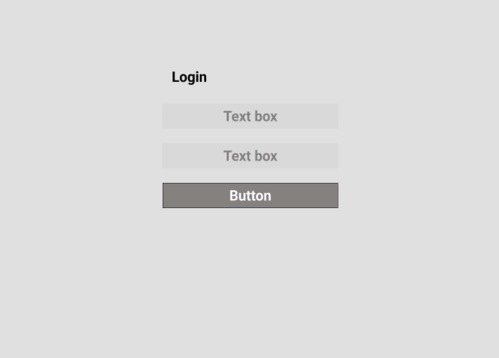

- Cabeçalho:

Título: "StaffTrack" centralizado na parte superior.

- Ícone:

Três figuras representando pessoas com cabeças e corpos. 

- Botões de Ação:

Botão "Cadastro e Operações" e “Relatórios”: Centralizado abaixo das figuras.
Botão Seletor de cargo que exibe opções de cargos (Gerente de Vendas, Vendedor, Motorista).

**Cadastro e Operações**

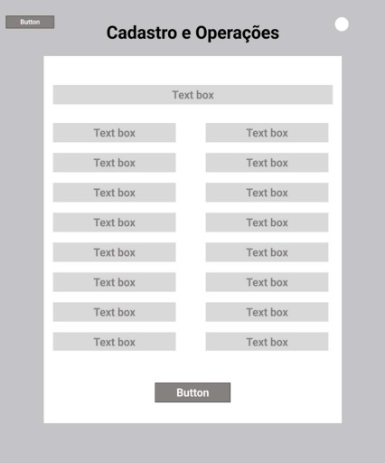

- Cabeçalho:

Um título grande "Cadastro e Operações" na parte superior da página.
Um botão "Retornar" alinhado à esquerda, que leva o usuário de volta à página principal.
Um botão de menu no canto superior direito, que, quando clicado, revela um menu suspenso com opções
como "Opções" e "Logout". 

- Campos de Entrada:

Dependendo da opção escolhida no seletor de cargo (Gerente de Vendas, Vendedor, Motorista), os
campos de entrada do formulário podem variar para atender as informações específicas de cada cargo. 

Protótipo Criado para (Gerente de Vendas), mas no caso de outros cargos, como Vendedor ou Motorista,
alguns campos poderão ser ocultados ou adaptados. 

Isso torna o sistema dinâmico e adaptado às necessidades específicas de cada cargo.

**Relatórios**

 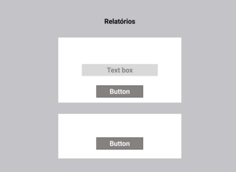

- Campos de Entrada:

ID: Campo de entrada para o ID.

- Botões:
  
Gerar Relatório: Um botão/link para selecionar um funcionário específico.
Gerar Relatório Completo: Um botão/link para gerar um relatório que abranja todos os funcionários. 

# TG1 – Cenário de Negócio, Concepção do Sistema e Modelo de Casos de Uso

## Modelo de Casos de Uso

### Identificação dos Casos de Uso por Ator

**Atores:**

- **Gerente:** Responsável pelo gerenciamento de funcionários.  
- **Funcionário:** Pode visualizar suas informações.  
- **Sistema de Relatórios:** Gera os relatórios automaticamente conforme solicitação.

| Ator                   | Caso de Uso                          |
|------------------------|--------------------------------------|
| Gerente                | Fazer login                          |
| Gerente                | Cadastrar funcionário                |
| Gerente                | Editar informações do funcionário    |
| Gerente                | Excluir funcionário                  |
| Gerente                | Gerar relatório de funcionários      |
| Funcionário            | Visualizar informações pessoais      |
| Sistema de Relatórios  | Emitir relatório automaticamente     |

---

### Descrição Resumida dos Casos de Uso

- **Fazer login:** O gerente acessa o sistema mediante autenticação.  
- **Cadastrar funcionário:** O gerente adiciona um novo funcionário ao sistema.  
- **Editar informações do funcionário:** O gerente atualiza os dados de um funcionário existente.  
- **Excluir funcionário:** O gerente remove um funcionário do sistema.  
- **Gerar relatório de funcionários:** O gerente solicita a geração de um relatório detalhado.  
- **Visualizar informações pessoais:** Funcionários podem visualizar suas próprias informações.  
- **Emitir relatório automaticamente:** O sistema gera um relatório baseado nos critérios definidos.

---

### Caso de Uso Crítico: Cadastro e Operações

Este caso de uso permite que o gerente realize operações relacionadas ao cadastro e gerenciamento de funcionários, incluindo adicionar novos funcionários, editar suas informações e excluí-los do sistema.

#### Atores

- **Usuário:** Responsável por solicitar e realizar a edição dos dados.  
- **Sistema:** Responsável por validar e atualizar os dados no banco de dados.

#### Descrição

Este caso de uso permite que o usuário edite informações previamente cadastradas no sistema. Envolve a recuperação dos dados existentes, a modificação dos valores e a validação antes da atualização definitiva no banco de dados.

#### Fluxo Principal

1. O usuário acessa a opção de Editar Dados cadastrados.  
2. O sistema solicita que o usuário forneça critérios de busca para localizar o cadastro desejado.  
3. O usuário visualiza os dados atuais e seleciona o campo a ser editado.  
4. O sistema permite a alteração dos campos editáveis.  
5. O usuário modifica os dados conforme necessário.  
6. O sistema executa a validação dos novos dados.  
7. Se os dados forem válidos, o sistema atualiza as informações no banco de dados.  
8. O sistema exibe uma mensagem de confirmação da atualização.

#### Fluxos Alternativos

**Falha na Validação**  
Se os dados informados forem inválidos, o sistema exibe uma mensagem de erro e solicita que o usuário corrija as informações antes de prosseguir.

**Cancelamento da Edição**  
O usuário pode optar por cancelar a edição a qualquer momento. O sistema interrompe a operação e mantém os dados originais.

#### Pré-condições

- O usuário deve estar autenticado no sistema.  
- Os dados a serem editados devem existir no banco de dados.

---

### Diagramas

#### Login
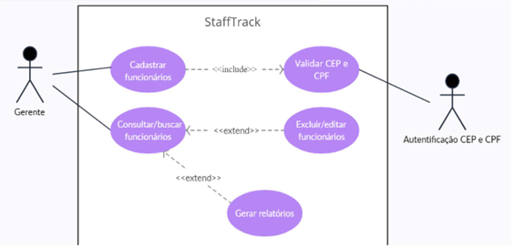

#### Cadastro e Operações
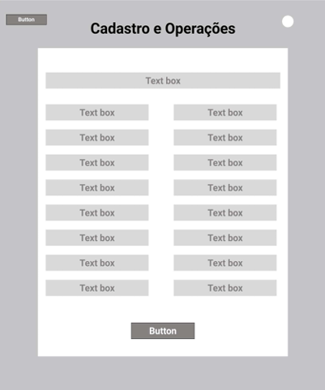

#### Geração de Relatórios
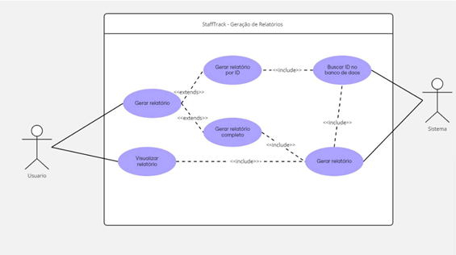

# TG2 – Modelagem de Negócio e Prototipação

## Modelagem de Domínio do Projeto

### Metodologia de Modelagem

A modelagem de domínio foi realizada com base na abordagem orientada a objetos, visando estruturar o sistema de maneira modular e reutilizável. Foram utilizadas técnicas de modelagem como **UML (Unified Modeling Language)** e padrões de análise para definir as entidades e suas relações, garantindo coerência e expansibilidade do sistema.

---

### Estrutura da Modelagem

A modelagem foi estruturada em:

- **Entidades Principais:** Representam os principais elementos do sistema.  
- **Relacionamentos:** Definem como as entidades interagem entre si.  
- **Regras de Negócio:** Determinam as restrições e comportamentos esperados do sistema.

---

### Entidades Principais

As seguintes entidades foram identificadas e modeladas:

- **Usuário**
  - ID
  - Nome
  - Email
  - Senha (criptografada)
  - Tipo (Gerente ou Funcionário)

- **Gerente** (Especialização de Usuário)
  - Lista de Funcionários supervisionados
  - Permissão para edição e exclusão de registros

- **Funcionário** (Especialização de Usuário)
  - CPF
  - CEP
  - Endereço (preenchido automaticamente via API ViaCEP)
  - ID do Gerente Responsável

- **Autenticação**
  - Processo de login e validação de credenciais

- **Cadastro**
  - Permite a criação de novos usuários no sistema

- **Sistema de Busca**
  - Localiza funcionários pelo nome ou ID
  - Disponibiliza opções de edição e exclusão apenas para gerentes

- **Validação de Dados**

- **Notificações**

- **Relatórios**
  - Gera análises sobre os dados de funcionários e gerentes
  - Exporta relatórios em PDF e CSV

---

### Padrões de Análise Utilizados

A modelagem utilizou os seguintes padrões:

- **Padrão MVC (Model-View-Controller):** Separando a lógica de negócio da interface gráfica para facilitar a manutenção e expansão.  
- **Padrão Repository:** Para gerenciar o acesso aos dados no banco PostgreSQL de forma desacoplada.  
- **Padrão Singleton:** Para garantir uma única instância do gerenciador de conexão ao banco de dados.  
- **Padrão Observer:** Para implementar o sistema de notificações de forma eficiente.

---

### Modelagem Baseada em Casos de Uso

Os casos de uso ajudaram a definir os comportamentos do sistema. Alguns exemplos:

- **Cadastro de Funcionários e Gerentes**
  - **Entrada:** Dados do usuário  
  - **Processamento:** Validação de CPF e CEP, associação com gerente  
  - **Saída:** Registro criado com sucesso

- **Login e Autenticação**
  - **Entrada:** Credenciais do usuário  
  - **Processamento:** Verificação de senha e permissões  
  - **Saída:** Acesso concedido ou negado

- **Busca de Funcionários**
  - **Entrada:** Nome ou ID  
  - **Processamento:** Consulta no banco de dados  
  - **Saída:** Lista de resultados

- **Geração de Relatórios**
  - **Entrada:** Parâmetros de filtro (período, setor, gerente)  
  - **Processamento:** Consolidação e formatação dos dados  
  - **Saída:** Relatório gerado e disponibilizado para download

---

### Modificações Realizadas na Modelagem

Com base na análise inicial, foram feitas algumas modificações:

- Adicionada a entidade **Notificação** para alertar gerentes sobre alterações nos registros.  
- Melhoria no processo de **validação de dados** para garantir maior segurança e precisão.  
- Integração de **API para consulta automática de endereços via CEP**.  
- Inclusão da funcionalidade de **exportação de relatórios em PDF e CSV**.  
- Implementação do **padrão Observer** para otimizar as notificações.

# TG2 – Modelagem de Negócio e Prototipação

## Prototipação

A prototipagem será utilizada para criar uma visualização inicial das telas principais do sistema, como:

- Tela de login  
- Tela inicial  
- Telas de cadastro  
- Telas de relatórios

Esses protótipos ajudarão a equipe a identificar precocemente problemas de usabilidade e a validar os requisitos mais críticos, como busca de funcionários e controle de acesso.

Os protótipos serão desenvolvidos apenas para as telas principais do sistema, permitindo uma visão clara das funcionalidades essenciais. Não será feito protótipo para todas as telas, já que o objetivo é ajustar o fluxo geral e garantir uma boa experiência de navegação nas partes mais importantes.

---

## 1. Protótipo de Baixa Fidelidade (Wireframes)

### Tela de Login
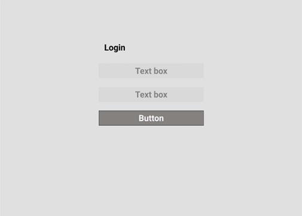
**Cabeçalho:**  
- Um título centralizado, como **"Login"**, para indicar a função da tela.

**Formulário de Login:**  
- Um campo de entrada para o nome de usuário ou e-mail, com um rótulo **"Usuário"** acima dele.  
- Um campo de entrada do tipo "senha" com o rótulo **"Senha"**.  
- Um botão centralizado com o texto **"Login"** que, ao ser clicado, envia as credenciais para autenticação.

---

### Tela Inicial
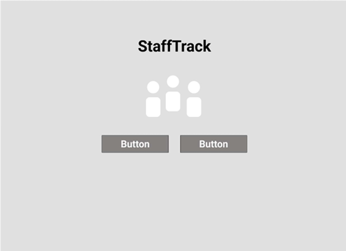
**Cabeçalho:**  
- Título: **"StaffTrack"** centralizado na parte superior.

**Ícone:**  
- Três figuras representando pessoas com cabeças e corpos.

**Botões de Ação:**  
- Botões **"Cadastro e Operações"** e **“Relatórios”** centralizados abaixo das figuras.  
- Um botão **Seletor de cargo** que exibe opções como:  
  - Gerente de Vendas  
  - Vendedor  
  - Motorista

---

### Cadastro e Operações

**Cabeçalho:**  
- Título grande **"Cadastro e Operações"** no topo da página.  
- Botão **"Retornar"** alinhado à esquerda, redirecionando à tela principal.  
- Botão de menu no canto superior direito que, ao ser clicado, revela opções como **"Opções"** e **"Logout"**.

**Campos de Entrada:**  
- Variam conforme a opção escolhida no **seletor de cargo** (Gerente de Vendas, Vendedor, Motorista).  
- O protótipo foi criado para **Gerente de Vendas**, mas para outros cargos (como Vendedor ou Motorista), alguns campos podem ser ocultados ou adaptados.  
- Isso torna o sistema dinâmico e adaptável às necessidades específicas de cada função.

### Relatórios
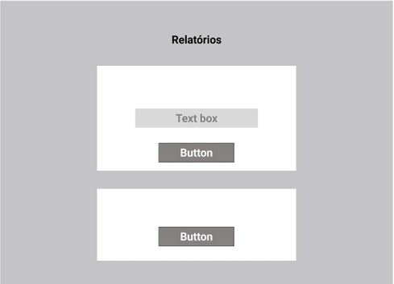

**Campos de Entrada:**  
- **ID:** Campo para entrada de um ID específico.

**Botões:**  
- **Gerar Relatório:** Gera relatório para um funcionário específico.  
- **Gerar Relatório Completo:** Gera um relatório que abrange todos os funcionários.

# TG3 – Especificação de Requisitos

## Requisitos Funcionais

### Autenticação e Acesso

**[RF001] - Login de Usuários**  
O sistema deve permitir que gerentes e funcionários façam login com e-mail e senha. Após 5 tentativas falhas, a conta deve ser bloqueada temporariamente.

**[RF002] - Controle de Permissões**  
Gerentes devem ter acesso completo ao sistema, enquanto funcionários só podem visualizar seus próprios dados.

### Gestão de Funcionários

**[RF003] - Cadastro de Funcionários**  
O sistema deve permitir que gerentes cadastrem novos funcionários com os campos obrigatórios: Nome, CPF, CEP, Cargo, Data de Admissão.

**[RF004] - Edição e Exclusão de Funcionários**  
O sistema deve permitir que apenas gerentes editem ou desativem (exclusão lógica) funcionários sob sua supervisão.

**[RF005] - Consulta de Funcionários**  
O sistema deve permitir busca por nome, ID ou departamento, com filtros avançados (ativos/inativos, período de admissão).

### Validações e Integrações

**[RF006] - Validação de CPF**  
O sistema deve validar o CPF usando algoritmo oficial e impedir cadastro se inválido ou duplicado.

**[RF007] - Integração com ViaCEP**  
Ao inserir um CEP válido, o sistema deve preencher automaticamente Logradouro, Bairro, Cidade e Estado.

### Relatórios e Notificações

**[RF008] - Geração de Relatórios**  
O sistema deve gerar relatórios em PDF e CSV com filtros por período, departamento e cargo.

**[RF009] - Notificação de Contratos**  
O sistema deve notificar gerentes por e-mail sobre contratos que vencerão em 6 meses.

---

## Requisitos Não Funcionais

### Requisitos de Segurança

**[RNF001] - Criptografia de Dados Sensíveis**  
Todos os dados sensíveis devem ser armazenados com criptografia AES-256 no banco de dados.

**[RNF002] - Controle de Acesso Hierárquico**  
Gerentes acessam apenas funcionários do seu departamento. Funcionários veem apenas seus próprios dados.

**[RNF003] - Logs de Auditoria**  
Todas as alterações em registros de funcionários devem ser registradas (quem alterou, quando e quais campos).

### Requisitos de Usabilidade

**[RNF006] - Interface Intuitiva**  
- Menu lateral com ícones descritivos  
- Tooltips para funções complexas  
- Guia rápido de primeiros passos

**[RNF007] - Compatibilidade com Navegadores**  
Funcionamento garantido em diferentes navegadores web.

### Requisitos Tecnológicos

**[RNF008] - Stack Tecnológica**  
- Backend: Java 17 + Spring Boot 3.x  
- Banco de Dados: PostgreSQL 15  
- Frontend: HTML5, CSS3, Thymeleaf

**[RNF009] - Integração com APIs Externas**  
ViaCEP para consulta de endereços.

### Requisitos de Manutenibilidade

**[RNF010] - Documentação Técnica**  
Manual de implantação com requisitos de infraestrutura.

**[RNF011] - Backup Automatizado**  
Backups diários incrementais.

---

## Casos de Uso

### UC001 – Realizar Login

**Atores:** Gerente, Funcionário  
**Pré-condições:** Nenhuma  

**Fluxo Principal:**

1. Acessar página de login  
2. Preencher e-mail e senha  
3. Validação das credenciais  
4. Redirecionamento para dashboard

**Fluxos Alternativos:**

- FA1: Credenciais inválidas  
  - Mensagem: "E-mail ou senha incorretos"

- FA2: Conta bloqueada após 5 tentativas  
  - Mensagem: "Conta temporariamente bloqueada. Tente novamente mais tarde."

---

### UC002 – Cadastrar Funcionário

**Atores:** Gerente  
**Pré-condições:** Gerente autenticado  

**Fluxo Principal:**

1. Acessar "Cadastrar Funcionário"  
2. Preencher formulário  
3. Validar CPF e consultar CEP  
4. Salvar funcionário  
5. Mensagem de sucesso

**Fluxos Alternativos:**

- FA1: CPF inválido  
- FA2: CEP não encontrado → preenchimento manual

---

### UC003 – Editar Funcionário

**Atores:** Gerente  
**Pré-condições:** Funcionário existente  

**Fluxo Principal:**

1. Buscar funcionário  
2. Editar dados  
3. Salvar alterações  
4. Mensagem de sucesso

**FA1 - Cancelar edição:**  
Descarta alterações e retorna à lista

---

### UC004 – Excluir Funcionário

**Atores:** Gerente  
**Pré-condições:** Funcionário ativo  

**Fluxo Principal:**

1. Buscar funcionário  
2. Confirmar exclusão  
3. Marcar como inativo  
4. Mensagem de sucesso

**FA1 - Funcionário com vínculos ativos:**  
- Bloqueia exclusão  
- Mensagem: "Existem contratos ativos vinculados."

---

### UC005 – Gerar Relatório

**Atores:** Gerente  
**Pré-condições:** Gerente autenticado  

**Fluxo Principal:**

1. Acessar "Relatórios"  
2. Selecionar filtros  
3. Escolher formato  
4. Gerar relatório  
5. Download do arquivo

**FA1 - Nenhum resultado encontrado:**  
Mensagem de alerta

---

### UC006 – Validar CPF/CEP

**Atores:** Sistema (automático)  
**Pré-condições:** Cadastro ou edição em andamento  

**Fluxo Principal:**

1. Inserir CPF → validação  
2. Inserir CEP → consulta ViaCEP e preenchimento automático

**FA1 - CPF inválido:**  
Bloqueia cadastro

**FA2 - CEP não encontrado:**  
Permite edição manual

---

### UC007 – Notificar Contratos

**Atores:** Sistema (automático)  
**Pré-condições:** Contratos cadastrados  

**Fluxo Principal:**

1. Verifica contratos com vencimento em 6 meses  
2. Envia e-mail ao gerente  
3. Registra notificação no sistema

**FA1 - Sem contratos próximos do vencimento:**  
Loga mensagem: "Nenhum contrato para notificar hoje"

---

## Regras de Negócio – StaffTrack

### 1. Controle de Acesso e Segurança

**RN001:** Acesso somente para usuários autenticados  
- Gerentes: acesso completo  
- Funcionários: acesso restrito

**RN002:** Troca obrigatória de senha no primeiro login

---

### 2. Gestão de Funcionários

**RN003:** Validação de documentos  
- CPF válido e único  
- CEP via API  
- RG com formato estadual

**RN004:** Hierarquia organizacional  
- Gerente só gerencia funcionários do próprio departamento  
- Funcionário precisa estar vinculado a um gerente

**RN005:** Status de funcionário  
- Novo: "Ativo"  
- Exclusão: lógica (status "Inativo")

---

### 3. Dados e Integrações

**RN007:** Endereço automático via CEP  
- Preenchimento automático de endereço  
- Número continua obrigatório

---

### 4. Prazos e Notificações

**RN008:** Notificações de contratos  
- 180 dias: primeiro alerta  
- 30 dias: alerta urgente  
- E-mail + dashboard do gerente

**RN009:** Período experimental  
- 90 dias como "Em experiência"  
- Alerta 15 dias antes do fim

---

### 5. Relatórios e Auditoria

**RN010:** Relatórios  
- Carimbo de data, usuário e filtros aplicados  
- Armazenamento por 1 ano

**RN011:** Rastreamento de alterações  
- Registra quem, quando, o quê e os valores antigo e novo

# TG4 – Modelos de Interação com Aplicação de Padrões GRASP

## Caso de Uso: Editar Informações do Funcionário

Este caso de uso permite que um usuário (gerente) edite as informações previamente cadastradas de um funcionário no sistema, podendo modificar os valores e atualizar os dados no banco de dados.

---

## Diagrama de Sequência de Projeto

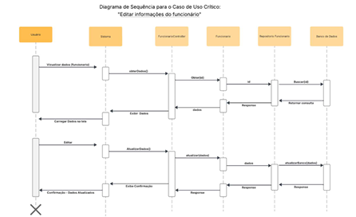

---

## Aplicação dos Padrões GRASP

### 1. Especialista em Informação (Information Expert)

**Responsabilidade:**  
Determinar qual objeto deve ser responsável por acessar e modificar os dados do funcionário.

**Aplicação:**

- **Funcionario:** Responsável por armazenar e fornecer acesso aos seus próprios dados.
- **RepositorioFuncionario (ou FuncionarioDAO):** Responsável por persistir os dados no banco de dados, com o conhecimento necessário para interagir com o banco.

**Motivo:**  
Atribuir responsabilidade à classe que possui a informação necessária leva a um design mais natural e coeso.

---

### 2. Controlador (Controller)

**Responsabilidade:**  
Receber a requisição do usuário e coordenar a operação de edição.

**Aplicação:**

- **FuncionarioController:** Recebe a requisição da interface do usuário, orquestra a busca e atualização dos dados via RepositorioFuncionario e gera a resposta ao usuário.

**Motivo:**  
Centraliza a lógica de controle do caso de uso, promovendo organização e separação de responsabilidades.

---

### 3. Coesão Alta (High Cohesion)

**Responsabilidade:**  
Manter cada classe focada em um conjunto limitado de responsabilidades relacionadas.

**Aplicação:**

- **Funcionario:** Responsável apenas pelos dados e comportamentos do funcionário.
- **RepositorioFuncionario:** Responsável apenas pela persistência dos dados.
- **FuncionarioController:** Responsável por coordenar o processo de edição.

**Motivo:**  
Classes coesas são mais fáceis de entender, manter e reutilizar, evitando classes com responsabilidades excessivas ("classes Deus").

---

### 4. Acoplamento Baixo (Low Coupling)

**Responsabilidade:**  
Reduzir as dependências entre as classes.

**Aplicação:**

- **FuncionarioController** depende de **RepositorioFuncionario**, mas não interage diretamente com o banco.
- **Funcionario** não depende da lógica de persistência.

**Motivo:**  
Baixo acoplamento torna o sistema mais flexível a mudanças e facilita a manutenção.

---

### 5. Indireção (Indirection)

**Responsabilidade:**  
Introduzir um objeto intermediário para mediar a comunicação entre objetos.

**Aplicação:**

- **RepositorioFuncionario** atua como intermediário entre **FuncionarioController** e o banco de dados.

**Motivo:**  
Desacopla as classes, permitindo maior flexibilidade (por exemplo, mudar a implementação da persistência sem impactar o controlador).

---

## Conclusão

A aplicação dos padrões GRASP neste caso de uso resultou em:

- Alta coesão  
- Baixo acoplamento  
- Maior flexibilidade

As classes possuem responsabilidades bem definidas, o sistema torna-se mais fácil de entender, manter e está preparado para futuras mudanças.

# TG6 – Descrição da Arquitetura do Sistema

## Diagrama de Pacotes

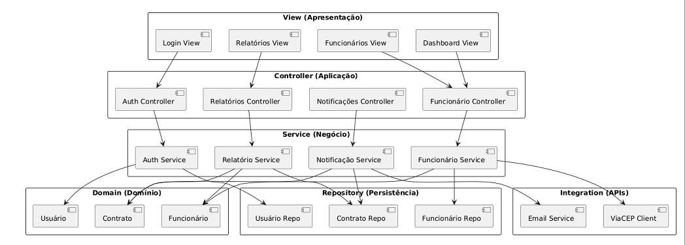

## 1. Arquitetura Escolhida: Arquitetura em Camadas

A arquitetura utilizada no sistema **StaffTrack** é baseada no padrão arquitetural em camadas, que visa separar responsabilidades em diferentes níveis de abstração, promovendo baixa acoplagem e alta coesão. Essa abordagem facilita a manutenção, testes e futuras evoluções do sistema.

## 2. Justificativa da Arquitetura

A escolha da arquitetura em camadas foi motivada pelos seguintes fatores:

- O sistema possui funcionalidades bem segmentadas, como autenticação, gestão de usuários, geração de relatórios e integrações com APIs;  
- A separação em camadas permite independência entre interface, lógica de negócio e persistência de dados;  
- Favorece a organização do código, facilita testes unitários e garante maior flexibilidade na evolução da aplicação;  
- É compatível com a stack tecnológica adotada (Java + Spring Boot + Thymeleaf + PostgreSQL).

## 3. Descrição das Camadas

Abaixo estão as camadas lógicas do sistema e os respectivos pacotes utilizados no projeto:

### 1. Camada de Apresentação (View)

Responsável pela interface com o usuário. Usa **HTML5**, **CSS3** e **Thymeleaf**. Exemplos de pacotes:

- `view.login`: Tela de login  
- `view.dashboard`: Tela principal  
- `view.funcionarios`: Listagem e formulário de funcionários  
- `view.relatorios`: Tela de geração de relatórios

---

### 2. Camada de Aplicação (Controller)

Intermedia a comunicação entre a **View** e os **serviços**. Pacotes:

- `controller.auth`: Lida com autenticação e login  
- `controller.funcionario`: Gerencia CRUD de funcionários  
- `controller.relatorios`: Coordena geração de relatórios  
- `controller.notificacoes`: Gerencia notificações automáticas

---

### 3. Camada de Negócio (Service)

Contém as **regras de negócio** e orquestra as operações do sistema. Pacotes:

- `service.auth`: Validações de login e senha  
- `service.funcionario`: Regras de cadastro, edição, exclusão e validações de documentos  
- `service.relatorios`: Filtros e formatação de relatórios  
- `service.notificacoes`: Envio de e-mails e alertas

---

### 4. Camada de Domínio (Domain)

Contém as **entidades principais** do sistema, modeladas com classes orientadas a objetos:

- `domain.usuario`: Representa gerente e funcionário  
- `domain.funcionario`: Dados do colaborador  
- `domain.contrato`: Contratos de trabalho e prazos

---

### 5. Camada de Persistência (Repository)

Acesso ao **banco de dados**, com uso de **Spring Data JPA**:

- `repository.usuario`  
- `repository.funcionario`  
- `repository.contrato`

---

### 6. Camada de Integração (Integration)

Responsável pela comunicação com **serviços externos**:

- `integration.viacep`: Consulta de endereços via API pública  
- `integration.email`: Serviço de envio de notificações por e-mail

