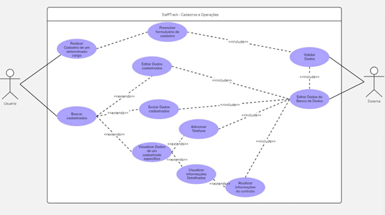

# RA_10409476_DevSis_2.2
Lucas Bittencourt de Oliveira, TIA: 42219851 || RA: 10409476

<h2><a href= "https://www.mackenzie.br">Universidade Presbiteriana Mackenzie</a></h2>
<h3><a href= "https://www.mackenzie.br/graduacao/sao-paulo-higienopolis/sistemas-de-informacao">Sistemas de Informação</a></h3>

**Conteúdo**

- [Autores](#autores)
- [Cenário de Negocio & Concepção](#cenário-de-negocio-&-concepção)
- [Modelagem de negócio e prototipação](#modelagem-de-negócio-e-prototipação)
- [Modelagem de negócio e prototipação](#Modelagem-de-negócio-e-prototipação)

# Autores

* Lucas Bittencourt de Oliveira - TIA 42219851/RA 10409476

# Cenário de Negócio/Concepção: 

**O problema ou oportunidade percebida:**

O problema identificado é a gestão ineficiente das informações dos funcionários em
empresas de médio e grande porte, onde muitas ainda utilizam processos manuais ou
sistemas descentralizados. Isso resulta em falhas na comunicação, perda de
informações, retrabalho e baixa eficiência operacional. 

**A razão ou justificativa para esta demanda:**

A necessidade de um sistema informatizado surge para reduzir erros de dados,
melhorar a segurança das informações, otimizar a administração de funções cruciais e
garantir um controle hierárquico eficiente de acessos e permissões. 

**A descrição sucinta do produto de software que será produzido:**

O sistema será um software de cadastro de funcionários, permitindo centralização das informações, validação automática de dados, controle de acesso por níveis, busca eficiente e gestão simplificada para facilitar a administração de recursos humanos. 

**Identifique os clientes, usuários e demais envolvidos/impactados com o produto:**

- Gerentes: Principais usuários do sistema, responsáveis pelo cadastro, edição e exclusão de informações dos funcionários sob sua supervisão.
- Departamentos de Recursos Humanos: Impactados diretamente pelo sistema, pois ele facilitará a coleta, atualização e análise de dados dos funcionários.
- Funcionários: Beneficiados indiretamente pela melhoria na gestão das suas informações dentro da empresa.

**Identifique os principais critérios de qualidade para o produto:**

- Centralização das informações: Dados armazenados de maneira organizada e acessível.
- Validação automática de dados: Evita erros em informações críticas como CPF e CEP.
-  Controle de acesso por níveis: Garante que apenas gerentes autorizados possam editar ou excluir dados.
-  Busca eficiente: Permite localização rápida de funcionários pelo nome ou ID
-  Usabilidade: Interface intuitiva e fácil de usar para garantir adoção pelos usuários.
-  Segurança: Proteção de dados sensíveis contra acessos não autorizados.
-  Eficiência operacional: Redução do tempo gasto em processos manuais e eliminação de retrabalho.

# Modelagem de negócio e prototipação

**Metodologia de Modelagem**
A modelagem de domínio foi realizada com base na abordagem orientada a objetos, visando estruturar o
sistema de maneira modular e reutilizável. Foram utilizadas técnicas de modelagem como UML (Unified
Modeling Language) e padrões de análise para definir as entidades e suas relações, garantindo coerência e
expansibilidade do sistema. 

**Estrutura da Modelagem**

A modelagem foi estruturada em:

- Entidades Principais: Representam os principais elementos do sistema.
- Relacionamentos: Definem como as entidades interagem entre si.
- Regras de Negócio: Determinam as restrições e comportamentos esperados do sistema.

**2. Entidades Principais**

As seguintes entidades foram identificadas e modeladas: 
- Usuário
- ID
- Nome
- Email
- Senha (criptografada)
- Tipo (Gerente ou Funcionário)
- Gerente (Especialização de Usuário)
- Lista de Funcionários supervisionados
- Permissão para edição e exclusão de registros
- Funcionário (Especialização de Usuário)
- CPF
- CEP
- Endereço (preenchido automaticamente via API ViaCEP)
- ID do Gerente Responsável
- Autenticação
- Processo de login e validação de credenciais
- Cadastro
- Permite a criação de novos usuários no sistema
- Sistema de Busca
- Localiza funcionários pelo nome ou ID
- Disponibiliza opções de edição e exclusão apenas para gerentes
- Validação de Dados
- Notificações
- Relatórios
- Gera análises sobre os dados de funcionários e gerentes
- Exporta relatórios em PDF e CSV

  **3. Padrões de Análise Utilizados**

- A modelagem utilizou os seguintes padrões:
- Padrão MVC (Model-View-Controller): Separando a lógica de negócio da interface gráfica
para facilitar a manutenção e expansão.
- Padrão Repository: Para gerenciar o acesso aos dados no banco PostgreSQL de forma
desacoplada.
- Padrão Singleton: Para garantir uma única instância do gerenciador de conexão ao banco de
dados.
- Padrão Observer: Para implementar o sistema de notificações de forma eficiente. 

**4. Modelagem Baseada em Casos de Uso**

- Os casos de uso ajudaram a definir os comportamentos do sistema. Alguns exemplos:
- Cadastro de Funcionários e Gerentes
- Entrada: Dados do usuário
- Processamento: Validação de CPF e CEP, associação com gerente
- Saída: Registro criado com sucesso
- Login e Autenticação
- Entrada: Credenciais do usuário
- Processamento: Verificação de senha e permissões
- Saída: Acesso concedido ou negado
- Busca de Funcionários
- Entrada: Nome ou ID
- Processamento: Consulta no banco de dados
- Saída: Lista de resultados
- Geração de Relatórios
- Entrada: Parâmetros de filtro (período, setor, gerente)
- Processamento: Consolidação e formatação dos dados
- Saída: Relatório gerado e disponibilizado para download 

**5. Modificações Realizadas na Modelagem**

- Com base na análise inicial, foram feitas algumas modificações:
- Adicionada a entidade "Notificação" para alertar gerentes sobre alterações nos registros.
- Melhoria no processo de validação de dados para garantir maior segurança e precisão.
- Integração de API para consulta automática de endereços via CEP.
- Inclusão da funcionalidade de exportação de relatórios em PDF e CSV.
- Implementação do padrão Observer para otimizar as notificações. 

# Modelagem de negócio e prototipação

**Prototipação:**

A prototipagem será utilizada para criar uma visualização inicial das telas principais do sistema, como a tela
de login, a tela inicial e as telas de cadastro e relatórios.
Esses protótipos ajudarão a equipe a identificar precocemente problemas de usabilidade e a validar os
requisitos mais críticos, como busca de funcionários e controle de acesso.
Os protótipos serão desenvolvidos apenas para as telas principais do sistema, permitindo uma visão clara
das funcionalidades essenciais. Não será feito protótipo para todas as telas, já que o objetivo é ajustar o
fluxo geral e garantir uma boa experiência de navegação nas partes mais importantes. 

**1. Protótipo de Baixa Fidelidade (Wireframes)**

- Tela Login

- Cabeçalho:

Título: "StaffTrack" centralizado na parte superior.

- Ícone:

Três figuras representando pessoas com cabeças e corpos. 

- Botões de Ação:

Botão "Cadastro e Operações" e “Relatórios”: Centralizado abaixo das figuras.
Botão Seletor de cargo que exibe opções de cargos (Gerente de Vendas, Vendedor, Motorista).

**Cadastro e Operações**

- Cabeçalho:

Um título grande "Cadastro e Operações" na parte superior da página.
Um botão "Retornar" alinhado à esquerda, que leva o usuário de volta à página principal.
Um botão de menu no canto superior direito, que, quando clicado, revela um menu suspenso com opções
como "Opções" e "Logout". 

- Campos de Entrada:

Dependendo da opção escolhida no seletor de cargo (Gerente de Vendas, Vendedor, Motorista), os
campos de entrada do formulário podem variar para atender as informações específicas de cada cargo. 

Protótipo Criado para (Gerente de Vendas), mas no caso de outros cargos, como Vendedor ou Motorista,
alguns campos poderão ser ocultados ou adaptados. 

Isso torna o sistema dinâmico e adaptado às necessidades específicas de cada cargo.

**Relatórios**

 

- Campos de Entrada:

ID: Campo de entrada para o ID.

- Botões:
  
Gerar Relatório: Um botão/link para selecionar um funcionário específico.
Gerar Relatório Completo: Um botão/link para gerar um relatório que abranja todos os funcionários. 

# Sistema de Gerenciamento de Funcionários

Este projeto consiste em um sistema de gerenciamento de funcionários com funcionalidades destinadas a gerentes, funcionários e um sistema automatizado de geração de relatórios.

## 📌 Objetivo

Desenvolver um sistema que permita:

- Gerenciar o cadastro de funcionários
- Consultar informações pessoais
- Gerar relatórios automáticos sobre os funcionários

## 👥 Atores e Casos de Uso

| **Ator**               | **Caso de Uso**                        |
|------------------------|----------------------------------------|
| Gerente                | Fazer login                            |
| Gerente                | Cadastrar funcionário                  |
| Gerente                | Editar informações do funcionário      |
| Gerente                | Excluir funcionário                    |
| Gerente                | Gerar relatório de funcionários        |
| Funcionário            | Visualizar informações pessoais        |
| Sistema de Relatórios  | Emitir relatório automaticamente       |

### 🧾 Descrição dos Casos de Uso

- **Fazer login**: O gerente acessa o sistema mediante autenticação.
- **Cadastrar funcionário**: O gerente adiciona um novo funcionário ao sistema.
- **Editar informações do funcionário**: O gerente atualiza os dados de um funcionário existente.
- **Excluir funcionário**: O gerente remove um funcionário do sistema.
- **Gerar relatório de funcionários**: O gerente solicita a geração de um relatório detalhado.
- **Visualizar informações pessoais**: Funcionários podem visualizar suas próprias informações.
- **Emitir relatório automaticamente**: O sistema gera um relatório baseado nos critérios definidos.

## 🔧 Caso de Uso Crítico: Cadastro e Operações

Este caso de uso permite ao gerente realizar operações de:

- Cadastro de novos funcionários
- Edição de dados existentes
- Exclusão de registros

### **Atores Envolvidos**

- **Usuário**: Gerente que solicita alterações
- **Sistema**: Realiza validações e atualizações

### **Fluxo Principal**

1. O usuário acessa a opção de editar dados.
2. O sistema solicita critérios de busca.
3. O usuário visualiza os dados e seleciona o campo a ser editado.
4. O sistema permite a edição dos campos.
5. O usuário modifica os dados.
6. O sistema valida os novos dados.
7. Se válidos, o sistema atualiza o banco de dados.
8. O sistema confirma a atualização.

### **Fluxos Alternativos**

- **Falha na Validação**: Exibe erro e solicita correção dos dados.
- **Cancelamento da Edição**: O usuário pode cancelar a operação, mantendo os dados originais.

### **Pré-condições**

- O usuário deve estar autenticado.
- Os dados a serem editados devem existir no banco de dados.

## 🖼 Diagramas

### 📌 Login

### 📌 Cadastro e Operações

### 📌 Geração de Relatórios

---

> 📁 As imagens estão localizadas na pasta `Docs/` na raiz do projeto.
